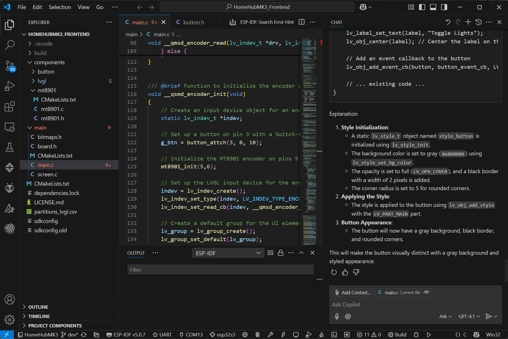
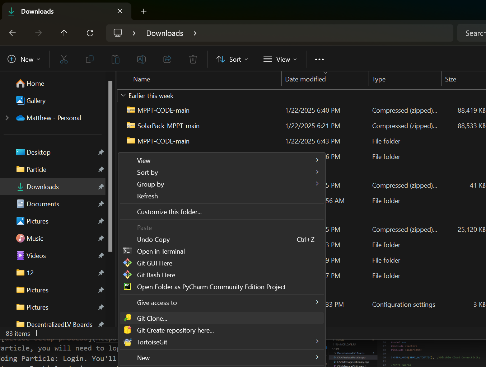
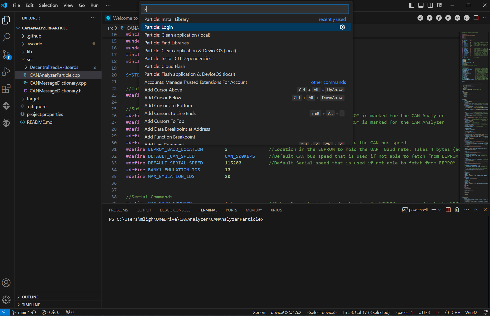

# HomeHubMK3

Third-generation of a smart home lighting controller that automatically manages TP-Link Kasa smart bulbs based on the proximity of Bluetooth LE devices (such as iPhones and Apple Watches).

---

## Fundamental Philosophy

This project uses a [Particle Photon 2](https://docs.particle.io/reference/datasheets/wi-fi/photon-2-datasheet/) which scans for devices over Bluetooth LE. In the scan, it looks at the BLE [Advertising Data](https://docs.silabs.com/bluetooth/6.2.0/bluetooth-fundamentals-advertising-scanning/advertising-data-basics). I found that Apple's devices have two bytes which stay relatively consistent, which I can use to identify my devices out of all of the others in the room. For example, my iPhone has unique bytes with values of `7 31`, while my Apple Watch has unique bytes with values of `5 152`.

 

The Bluetooth signal is then used to sense if someone is in the room and control the lights based on presence. This is done with the Photon 2, which controls a set of TP-Link smart bulbs (mine are the KL-130) and smart plugs (HS-103) over Wi-Fi. Additionally, there is webhook integration, which allows commands to be sent from Siri Shortcuts to the Photon to update the state of the controller.

On the HomeHubMK2, the Photon 2 served as the BLE controller, bulb controller, and GUI, but this new revision uses a separate controller for the GUI to improve performance. The GUI is powered by the [Light and Versatile Graphics Library](https://lvgl.io/) (LVGL) on a ZX2D10GE01R round-screen user interface running on an ESP32-S3 microcontroller . LVGL has many convenient functions to show controls such as dials, combo boxes, buttons and many more.

## Hardware Progression (Getting an Upgrade!)

Here are the previous revisions this project replaces. This project originally started back in 2020 with the Lulu eGames entrepreneurship competition at NC State. After the competition, I continued to upgrade the hardware for personal use to control the lights in my room.

### SmartIO Plug Prototype - Sketch-tastic!

The original hardware developed for the Lulu eGames competition had to be developed very quickly (was originally for a 3-day hackathon) and used a series of relays attached to a perfboard to act as a smart plug. To prevent electrical hazards we 3D printed a box around it and included a USB charger for convenience. The software didn't have any software filtering for the data, so the BLE presence control system was not very accurate.

 

### [HomeHubMK1](https://github.com/matthewpanizza/HomeHubBluetooth/tree/master/src) - Functional...

After a year of sitting on the shelf, I picked up the SmartIO software and found ways to tune it to better detect BLE device presence accurately. With a better understanding of the advertising data, I was able to filter out my iPhone and Apple Watch from the other BLE devices in the room (something I wasn't able to figure out in the original). I tested out the better software algorithm on the plug hardware and it was working much better than before. With the software working, I decided to replace the hardware I had for the Multicolor Lamp project I developed in high school with a control box that could sit on my desk. The Multicolor Lamp project was a device that controlled a strand of WS2812B LEDs (neopixels) and the Kasa smart bulbs using Siri shortcut commands. I combined this new BLE proximity detection with the old software and made the prototype hardware below, which had a joystick for mode selection, brightness and color temperature control along with a brightness sensor and toggle button.

### HomeHubMK2 - A Little More Polished

I continued using the HomeHubMK1 as my daily-driver for smart home control, and it functioned well, with some small quirks. After a year of using it, I found the joystick was a bit difficult to use (no visual feedback for which mode it was in) and the overall build quality was not very good. To further improve the design, I found a GC9A01 round LCD on eBay and though it would make for a great addition for displaying status to the user. I converted the joystick control to be based on an encoder as well - this vastly improved the intuitiveness of the device. Additionally, I added a DRV2605L haptic driver paired with a Taptic Engine (just a fancy Linear Resonant Actuator) I stole from an Apple Watch to emulate ticks when rotating the encoder and pressing the capacitive button. To further polish it up, I also packaged it up into a better-designed housing with a custom PCB I made using Altium Designer.

  
 
### HomeHubMK3 - One to Rule Them All

The HomeHubMK2 hardware was much more intuitive to use than the MK1 and the GUI certainly made its quality-of-life better. One downside to using the GC9A01 is that it is controlled over SPI, making updates to GUI elements slower compared to one that uses GPIO to send 8 or 16 bits of data at a time. I was in the process of developing a menu system on the MK2 for configuring the smart devices (some of the things listed in the [Planned Features](#planned-features-that-take-many-weekends-to-complete) section), but I was finding that the UI just couldn't update fast enough. Fast forward to a few months ago, I stumbled across the ESP32-based [ZX2D10GE01R](https://github.com/wireless-tag-com/ZX2D10GE01R-V4848) when I was scrolling through AliExpress and it seemed a lot more promising. After doing some digging, I found that it can be easily controlled with the [Light and Versatile Graphics Library](https://lvgl.io/) (LVGL), which has nice integrated functions for buttons, sliders, combo boxes and much more. Up to this point, I've got the basics set up on the ESP32 and Photon 2 to have the same functionality as the HomeHubMK2 and am using it as my daily driver now. I'm planning to continue adding features listed in the [Planned Features](#planned-features-that-take-many-weekends-to-complete) to further expand my smart home control system and integrate more sensors in the network.

## Planned Features (That Take Many Weekends to Complete!)

At the time of writing, the project has the basic functionality for proximity-based control from the original HomeHubMK1 and MK2 revisions as well as the upgraded UI hardware. Below are some of the planned improvements for the smart home system this device will be the core for:

- **Menu for adding Bluetooth LE target devices**: have the HomeHub scan for Bluetooth LE devices and signal strength. Allow the user to add these devices to the list of devices to track (held in EEPROM).
- **Menu for adding Kasa smart devices**: allow for adding of IP addresses to control.
- **Live weather data**: fetch data from [OpenWeatherMap](https://openweathermap.org/city/2643743) and display it on the frontend UI.
- **Cellular companion controller**: connect a second BLE and Cellular-capable MCU (Particle Boron) over UART to the Photon 2. This will enable fallback internet access and act as a BLE connection point.
- **Wireless accessory sensors**: using the second BLE controller in BLE peripheral mode, other BLE microcontrollers located elsewhere in the room can connect to the HomeHub and provide sensor data (ambient light, temperature, etc).
- **Integration with legacy [NeoPixel Clock](https://github.com/matthewpanizza/NeoPixelClock512) project**: allow the HomeHub to connect to the clock and navigate/configure the menu wirelessly. 
- **Mesh device sensing**: using multiple microcontrollers in a room for BLE target device scanning, the accuracy of the precense detection can be done (triangulation). This would allow rooms to be turned off if a device is triangulated to be in one room.
- **Device grouping**: with better triangulation, allow devices to be grouped into rooms and have certain groups turn off based on where presence-tracked devices are.

## Architecture

- **Frontend:** ESP32-S3 microcontroller with a round LCD display.
  - Runs LVGL for the UI.
  - Reads user input via rotary encoder and button.
  - Communicates with backend over UART.
  - Controls LCD backlight via PWM.

- **Backend:** Particle Photon 2.
  - Scans for BLE devices to detect user proximity.
  - Controls TP-Link Kasa smart bulbs and plugs over Wi-Fi.
  - Stores configuration and device data in EEPROM.
  - Communicates with frontend over UART.

---

## UART Command Protocol

### Commands Sent from ESP32-S3 (Frontend) to Photon 2 (Backend)

| Command | Description                                 | Example   |
|---------|---------------------------------------------|-----------|
| `UB%d`  | Set bulb brightness (0-100)                 | `UB75`    |
| `UC%d`  | Set bulb color temperature (24-70)          | `UC35`    |
| `UG`    | Toggle bulbs on/off                         | `UG`      |
| `UR`    | Request all UI parameters                   | `UR`      |

### Commands Sent from Photon 2 (Backend) to ESP32-S3 (Frontend)

| Command     | Description                                         | Example         |
|-------------|-----------------------------------------------------|-----------------|
| `MB%d`      | Update brightness slider (0-100)                    | `MB80`          |
| `MC%d`      | Update color temperature slider (24-70)             | `MC40`          |
| `MT%d %d`   | Update time (hours, minutes)                        | `MT10 23`       |
| `ML%d`      | Update LCD backlight percentage (0-100)             | `ML55`          |
| `MF%x %x %x`| Set bulb fill color (R G B, hex)                    | `MFff 96 3c`    |
| `MO%x %x %x`| Set bulb outline color (R G B, hex)                 | `MOff ff ff`    |
| `MW%d`      | Watch presence status (1=present, 0=away)           | `MW1`           |
| `MP%d`      | Phone presence status (1=present, 0=away)           | `MP0`           |

---

## UI Features

- **Brightness Slider:** Adjusts bulb brightness (0-100%).
- **Color Temperature Slider:** Adjusts bulb Kelvin color temperature (2400K-7000K).
- **Device Presence Icons:** Shows if a phone or watch is detected via BLE.
- **Bulb Icon:** Displays current bulb color and outline status.
- **Toggle Button:** Turns bulbs on or off.
- **Date/Time Display:** Shows current time, updated from backend.
- **Backlight Control:** LCD backlight adjusts based on ambient light sensor.

---

## Setting Up Visual Studio Code for ESP32-S3 Development

This section explains how to set up Visual Studio Code for ESP32-S3 development using the Espressif IDF, and how to add the LVGL graphics library for your frontend UI.

---

### Software Requirements

- **[Visual Studio Code](https://code.visualstudio.com/)**
- **[Python 3.7+](https://www.python.org/downloads/)**
- **[Git for Windows](https://git-scm.com/download/win)**
---

### Install the Espressif IDF VS Code Extension

1. Open VS Code and go to the Extensions tab.
2. Search for **Espressif IDF** and install it.

---

### 3. Run the Espressif IDF Setup Wizard

- Click the Espressif logo in the VS Code Activity Bar.
- Follow the tutorial webpage under the Install and Configure section. 
- I am using the ESP-IDF v5.0.7 for mine, but others may work.

---

### 4. Open the HomeHubMK3 Frontend Project

- Use the **ESP-IDF: Import Project** command to open the HomeHubMK3_Frontend Folder

---

### 5. Select the ESP32-S3 Target

- In the bottom status bar, select your target as `esp32s3`.
- Connect your device over USB using the ZX2D10GE01R's debugger adapter
- Choose the COM port that corresponds to the debugger

---

### 6. Build, Flash, and Monitor

- Use the buttons in the status bar or the Command Palette (`Ctrl+Shift+P`) to:
  - **Build** (`ESP-IDF: Build your project`)
  - **Flash** (`ESP-IDF: Flash your device`)
  - **Monitor** (`ESP-IDF: Monitor your device`)

---

## Setting Up the Particle Development Environment 

This section will explain how to install Visual Studio Code and set up the Particle workbench for installing and creating firmware on the backend microcontroller.

### Software Requirements
- [Visual Studio Code](https://code.visualstudio.com/): Main development environment for writing code and flashing firmware to devices.
- [Particle Workbench](https://marketplace.visualstudio.com/items?itemName=particle.particle-vscode-pack) extension for Visual Studio Code to support flashing of Particle devices.
- [Git for Windows](https://git-scm.com/downloads/win): Optional for interaction with Git repositories. Get this if you will be making changes to the software/hardware and need to track changes.
- [Tortoise Git](https://tortoisegit.org/download/): Optional graphical tool for performing repository actions. Get this if you will be making changes to the software/hardware and need to track changes.
- [Optional] Serial Console (I prefer the one in the [Arduino IDE](https://www.arduino.cc/en/software))

### Cloning a Repository

To get a copy of the code repository for one of the projects, you'll need to clone down the repo. I prefer to use TortoiseGit, but other Git interfaces will also work. Find a folder where you want to have the repo downloaded, right click, and choose ToritoiseGit -> Git Clone (Windows 11 may need to click "show more options").

In the menu that pops up, you'll need to enter a source for where the repo is located. You can find this on GitHub by expanding the "Code" menu. If you are planning on making changes to the code, it is recommended that you make a new branch on GitHub such that the working code is maintained on the `master` or `main` branch.

Once you've gotten a link and made a new branch, paste the link in the Tortoise menu and enter the branch you wish to clone down.

Press OK, and TortoiseGit should begin cloning down the repo. You may be asked to sign in to your browser on first setup.

### Opening Project and Flashing Firmware

After installing Visual Studio Code and the Particle Workbench Extension, you're now ready to install the firmware on the microcontroller. First, open up the cloned repository of the Particle project in Visual Studio Code by going to the Particle tab on the left toolbar and choosing Open Folder.

Choose the entire project folder from the cloned repo (don't just open the .cpp or the src folder).

Once you've opened the folder, go to the Explorer tab on the left toolbar and expand the "src" folder. This folder will contain the source code for the program. Depending on how new your project is, there may be a .ino and a .cpp, or just a .cpp file. If there is a .ino file, open that by double clicking on it.

With the source file opened, some new options should appear in the top left corner of VS Code. These are used to compile and flash the application to the device. If these do not appear, you may have opened the incorrect folder.

Before we can flash the application though, please make sure the options are set up correctly for your microcontroller. To choose a platform, go to the bottom toolbar of VS Code, and there is a platform selection. Change this to whichever microcontroller you are using (BSoM, Photon, Photon 2, Xenon, Argon, P2, etc.).

Next, connect your device using a USB cable to your computer. If you haven't registered the Particle device, its LED will be blinking blue. To set it up, follow Particle's [device setup process](https://setup.particle.io/). After registering with Particle, you will need to log in to Workbench by pressing Ctrl+Shift+P and doing Particle: Login. You'll need to log in for the flash tool to auto-detect your Particle device over USB, however there is a workaround. 

If your device has already had the Particle setup done on it, you can put it in DFU mode by pressing MODE and RESET, and then releasing RESET. Continue holding MODE until the LED is blinking yellow. From here you can flash the device. This is done by pressing the lightning bolt icon in the top right toolbar as previously shown. The output window will show the progress of the flash operation

**Important Note**: For the water vehicle code, ensure that you have [updated the bot number](#water-vehicle-identifier) before flashing! This is a unique ID used to identify the vehicle in the network

With the device flashed, you should now be running the new firmware.

